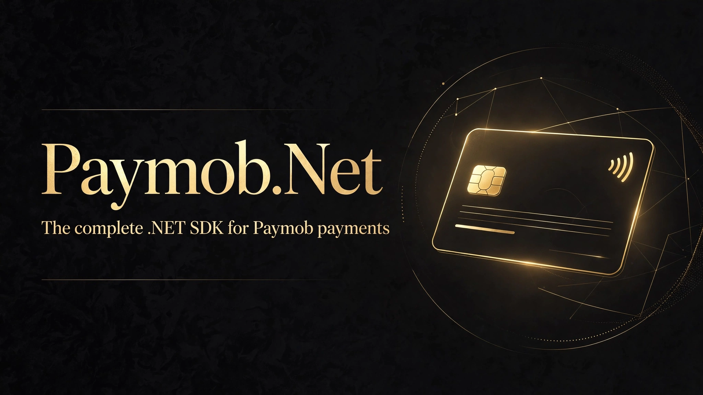

[](LICENSE)
[](https://dotnet.microsoft.com/)
[](https://github.com/SENESO/Paymob.Net/stargazers)

# Paymob.Net

The missing .NET SDK for **Paymob** — Egypt's leading payment gateway.

```csharp
using Paymob;
using Paymob.Models;

var client = new PaymobClient(new PaymobClientOptions
{
    ApiKey = "<your-api-key>",
    HmacSecret = "<your-hmac-secret>" // for webhook validation
});

// One call: auth → order → payment key → iframe URL
var checkout = await client.CreateCheckoutAsync(new CheckoutRequest
{
    AmountCents = 50000,          // 500.00 EGP
    Currency = "EGP",
    MerchantOrderId = "order-123",
    IntegrationId = 123456,       // card / wallet integration from the dashboard
    IframeId = 789012,
    BillingData = new BillingData
    {
        FirstName = "Ahmed",
        LastName = "Hassan",
        Email = "ahmed@example.com",
        PhoneNumber = "+201012345678",
        City = "Cairo",
        Country = "EG"
    }
});

return Redirect(checkout.IframeUrl); // customer pays on Paymob's page
```

## After the payment

```csharp
// Refund (full or partial)
await client.RefundAsync(transactionId: 12345, amountCents: 50000);

// Void before settlement (cards)
await client.VoidAsync(transactionId: 12345);

// Capture a previously authorized transaction
await client.CaptureAsync(transactionId: 12345, amountCents: 50000);

// Look up a transaction — the reconciliation fallback when callbacks lag
var txn = await client.GetTransactionAsync(12345);
```

These use `Authorization: Token {secret_key}` — set `PaymobClientOptions.SecretKey`.

## Intention API (unified checkout)

The newer flow — one call, then redirect:

```csharp
var intention = await client.CreateIntentionAsync(new IntentionRequest
{
    Amount = 50000,
    Currency = "EGP",
    PaymentMethods = new List<int> { 123456 }, // integration ids
    BillingData = billingData,
    Customer = new IntentionCustomer { FirstName = "Ahmed", LastName = "Hassan", Email = "ahmed@example.com" },
    NotificationUrl = "https://yoursite.com/api/paymob/webhook",
    RedirectionUrl = "https://yoursite.com/payment/done"
});

return Redirect(client.BuildUnifiedCheckoutUrl(intention.ClientSecret));
```

## ASP.NET Core DI

```csharp
services.AddPaymob(options =>
{
    options.ApiKey = builder.Configuration["Paymob:ApiKey"];
    options.SecretKey = builder.Configuration["Paymob:SecretKey"];
    options.PublicKey = builder.Configuration["Paymob:PublicKey"];
    options.HmacSecret = builder.Configuration["Paymob:HmacSecret"];
});

// then inject PaymobClient anywhere
```

## Webhook validation

Paymob POSTs transaction callbacks to your notification URL. Always verify the HMAC — otherwise anyone can forge a "payment succeeded" callback:

```csharp
using Paymob.Webhooks;

var json = await new StreamReader(Request.Body).ReadToEndAsync();
if (!PaymobWebhookValidator.IsValidCallback(hmacSecret, json))
    return Unauthorized();

// safe to trust: update the order
```

## Step-by-step (if you prefer)

```csharp
var authToken = await client.GetAuthTokenAsync();
var orderId = await client.CreateOrderAsync(authToken, request);
var paymentToken = await client.CreatePaymentKeyAsync(authToken, orderId, request);
var url = client.BuildIframeUrl(iframeId, paymentToken);
```

Bring your own `HttpClient` (e.g. from `IHttpClientFactory`):

```csharp
var client = new PaymobClient(options, httpClient);
```

API errors throw `PaymobApiException` with the HTTP status code and Paymob's response body.

## Targets

`netstandard2.0` and `net8.0`. Only dependency is `System.Text.Json`.

## License

MIT
